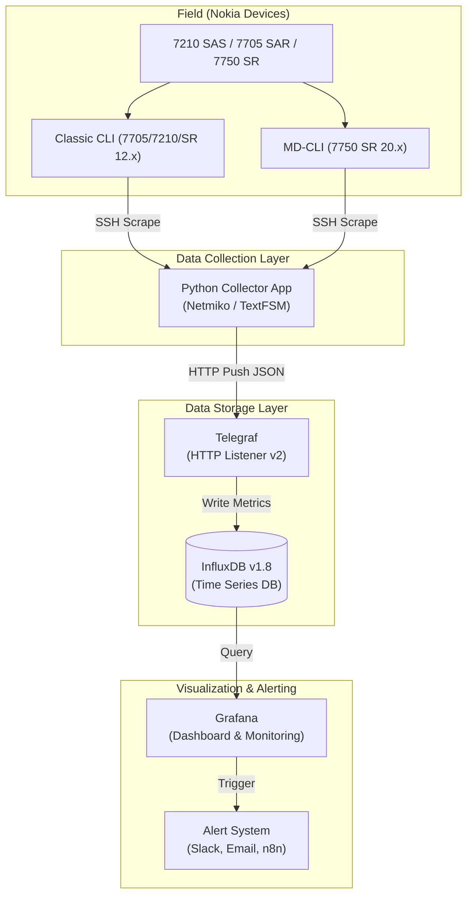
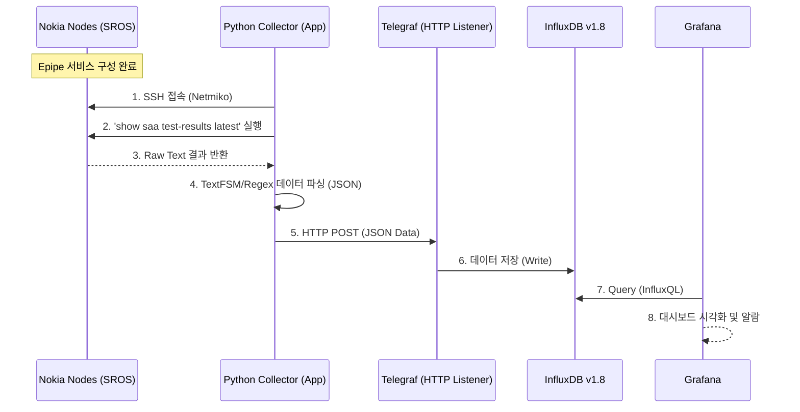

<div align="center">
  <h1>Nokia SAA-driven Performance Monitoring System</h1>
  <p>Nokia 멀티 세대 장비(7210 SAS, 7705 SAR, 7750 SR) 네트워크 품질 모니터링 자동화 솔루션</p>

  <!-- Badges -->
  
  
  
  
  
</div>

## 📖 목차 (Table of Contents)
- [프로젝트 배경 및 목표](#-프로젝트-배경-및-목표)
- [주요 기능](#-주요-기능)
- [대상 네트워크 환경](#-대상-네트워크-환경)
- [시스템 아키텍처](#-시스템-아키텍처)
- [시작하기 (Getting Started)](#-시작하기-getting-started)
- [설정 가이드](#-설정-가이드)
- [기여 및 참고 사항](#-기여-및-참고-사항)
- [라이선스 (License)](#-라이선스-license)

---

## 🎯 프로젝트 배경 및 목표
다양한 세대의 Nokia 장비(7210 SAS, 7705 SAR, 7750 SR)를 운영하는 환경에서, **Epipe (L2 P2P)** 서비스의 네트워크 품질(지연, 손실)을 실시간으로 측정하고 시각화하는 자동화 시스템입니다. 

구형 장비(TiMOS v6.x, v7.x)의 SNMP 성능 제약을 극복하기 위해 **Python 기반의 SSH Scraper (Push 방식)** 아키텍처를 도입하여 시스템 부하를 최소화하면서 안정적인 데이터 수집을 목표로 합니다.

## ✨ 주요 기능
- **멀티 세대 장비 지원**: Classic CLI (TiMOS-B) 및 최신 MD-CLI (TiMOS-C) 자동 대응
- **고효율 병렬 수집**: `concurrent.futures`를 활용한 멀티스레딩 SSH 수집 구현 (Netmiko)
- **정교한 데이터 파싱**: `TextFSM`을 활용한 장비 출력 결과 자동 파싱
- **유연한 데이터 파이프라인**: Telegraf (HTTP Listener v2)를 통한 데이터 수신 및 InfluxDB 시계열 저장
- **실시간 관제 대시보드**: Grafana를 통해 트래픽/품질 동시 비교 및 임계치 알람(Slack, Email 등) 전송

## 🖥 대상 네트워크 환경

| 장비 모델 | 주요 OS 버전 | 특이사항 |
| :--- | :--- | :--- |
| **7210 SAS-M** | TiMOS-B 7.0.R4 | 리소스 제약 심함, Classic CLI |
| **7210 SAS-Sx** | TiMOS-B 22.3.R3 | 최신형, Classic CLI |
| **7705 SAR** | TiMOS-B 6.1.R7 | 셀룰러 백홀 장비, Classic CLI |
| **7750 SR** | TiMOS-B 12.0.R9 | 표준 백본 장비, Classic CLI |
| **7750 SR** | TiMOS-C 20.10.R13 | 최신 MD-CLI (Model-Driven) 적용 |

## 🏗 시스템 아키텍처



## 🏗 시스템 플로우



## 🚀 시작하기 (Getting Started)

### 사전 요구 사항 (Prerequisites)
- Python 3.9+
- Docker & Docker Compose (Telegraf, InfluxDB, Grafana 구동용)
- 네트워크 장비 접근용 Read-only 계정

### 설치 (Installation)
```bash
# 1. 저장소 클론
git clone https://github.com/20eung/nokia-saa-monitor.git
cd nokia-saa-monitor

# 2. Python 가상환경 생성 및 의존성 설치
python -m venv venv
source venv/bin/activate
pip install -r requirements.txt
```

*(참고: 아직 코드가 업로드되지 않은 프로젝트 초기 단계입니다. 추후 코드가 추가되면 위 가이드를 따라주세요.)*

## 🛠 설정 가이드

### 1. 장비 측 설정 (ETH-CFM 및 SAA)
품질 측정을 위해 Epipe 양 끝단에 MEP(Maintenance Endpoint)를 설정해야 합니다. (자세한 설정 방법은 `README_rfp_backup.md` 참고)

### 2. 수집기 (Collector) 로직 가이드
수집기는 다음 사항을 준수하여 작성해야 합니다:
- **세션 제한 처리**: 7210 SAS-M과 같은 저사양 장비를 위해 수집 주기 5분~10분 이상 설정.
- **연결 최적화**: SSH 커넥션 풀링(Connection Pooling) 사용.
- **명령어 추출 (최신 데이터)**: `show saa test-results "PM_EPIPE_100" owner "NetDevOps" latest` 사용.

### 3. 데이터 스키마 (InfluxDB)
- **Tags**: `host`, `epipe_id`, `port`, `service_type`
- **Fields**: `avg_rtt`, `max_rtt`, `jitter`, `loss_count`, `if_in_octets`, `if_out_octets`

## 🤝 기여 및 참고 사항
이 프로젝트는 노후화된 Nokia 장비의 모니터링 한계를 극복하기 위해 기획되었습니다. Pull Request, Issue 등록을 언제나 환영합니다.
개발 가이드 및 이전 상세 스펙 문서는 [`README_rfp_backup.md`](./README_rfp_backup.md) 파일을 참고해 주세요.

## 📄 라이선스 (License)
이 프로젝트는 [MIT License](LICENSE)에 따라 배포됩니다.
